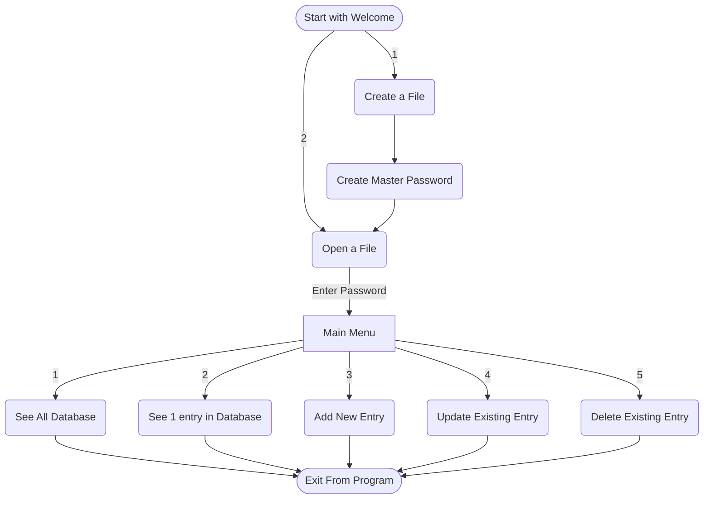

# 🔐 CLI Password Manager in Python

<!-- badges: start -->


[](https://app.codecov.io/gh/CodeStarter25/co2emissionsanalyzer) 


<!-- badges: end -->

---

### 🎥 [Video Demo](https://youtu.be/kyA6AvcbZJE)

---

## 📌 Description

A command-line password manager built in Python for the **CS50P Final Project**. It uses CSV files to store credentials and protects them using **salted encryption** via the `cryptography` library.

The tool is entirely self-contained, portable, and does not rely on third-party services. Designed for personal use and full control over your password database.

---

## 🧭 Introduction

This is a secure CLI tool for managing passwords. It features a simple prompt-based system where users can create/open encrypted password databases, view, add, update, or delete entries.

- Built using Python classes and loop-based menus
- Includes fail-safes to prevent unexpected crashes
- Clean, readable UI within the terminal

---

## 📊 How It Works

Users are prompted with numbered actions. Here's a high-level flow of the program:



<p>&nbsp;</p>

> 🔁 The user can safely exit at any point using `Ctrl + C`, and the program will prompt to save any unsaved changes.

---

## 🔐 Data Storage & Security

- Passwords are encrypted using the `cryptography` library with unique salts per file.
- Identical passwords will have different encrypted values due to salting.
- The program does **not** validate user-entered data — users are responsible for entering correct information.

> ⚠️ **Note:** The security and handling of data are the user’s responsibility. The author is not liable for any data loss or misuse.

---

## ✅ Features

- Secure encrypted CSV file handling  
- Built-in password generator with strength rating  
- Clean terminal UI design  
- Simple CSV file creation for password storage  
- Portable and easy to use  
- Timestamped creation and modification dates for each entry  
- Robust input validation and error handling  
- Checks passwords against compromised password lists  
- All related files (database and salt) are stored in a single folder named `resources` (created if missing)

---

## 🗂️ Data Stored per Entry

- Name  
- Email  
- Username  
- Password (manually entered or generated)  
- Notes  
- Creation Date/Time  
- Modification Date/Time  

---

## 📦 Requirements.txt

```text
cffi==1.17.1
cryptography==45.0.3
iniconfig==2.1.0
packaging==25.0
pluggy==1.6.0
pycparser==2.22
```

### Testing Dependency

```text
pytest==8.3.5
```

## 🧪 Data Resources Used

- Compromised password list: [NCSC Top 100k](https://www.ncsc.gov.uk/static-assets/documents/PwnedPasswordsTop100k.txt)  
- [Stack Overflow](https://stackoverflow.com)  
- [Mermaid.js](https://mermaid.js.org) (for flowchart rendering)

---

## 🚧 Future Improvements

- Initially planned a GUI version using Tkinter but switched to CLI for simplicity and better focus  
- Wanted to use SQLite for data storage but chose encrypted CSVs instead  
- Add contextual help messages and command-line arguments  
- Implement automatic clipboard clearing after copying passwords  
- Clear sensitive data from memory on exit for enhanced security

---

## 📅 Extra Information

- **Start Date:** 26 May 2025  
- **Completed Date:** 07 June 2025  
- **Version:** 1.0.0  
- **Status:** Complete and reviewed  

---

## 🙏 Thanks

Thanks to CS50P and all the helpful communities that supported me throughout this project.
